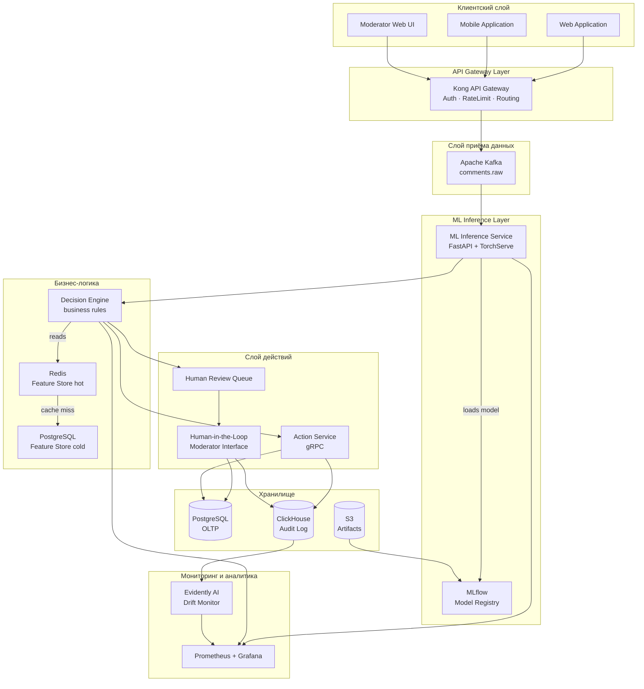

# Архитектура системы и UML-диаграмма компонентов

## Общая архитектура (C4 Level 2 — Container Diagram)

```
┌─────────────────────────────────────────────────────────────────────┐
│                        СОЦИАЛЬНАЯ СЕТЬ (контур)                      │
│                                                                       │
│  ┌──────────┐    ┌─────────────┐    ┌──────────────────────────────┐ │
│  │  Web UI  │    │ Mobile App  │    │  Moderator Dashboard (Web UI)│ │
│  └────┬─────┘    └──────┬──────┘    └──────────────┬───────────────┘ │
│       │                 │                           │                  │
│       └────────┬────────┘                           │                  │
│                ↓                                    │                  │
│        ┌───────────────┐                            │                  │
│        │  API Gateway  │ ←── Kong + Nginx ──────────┘                  │
│        │ rate limiting │                                               │
│        └───────┬───────┘                                               │
│                │                                                       │
│         ┌──────▼──────┐                                               │
│         │    Kafka    │ ◄── topic: comments.raw (partitions=32)        │
│         │  (3 nodes)  │ ◄── topic: decisions.audit                     │
│         └──────┬──────┘                                               │
│                │                                                       │
│    ┌───────────▼────────────┐                                         │
│    │   ML Inference Service │  (4× GPU replicas, k8s HPA)             │
│    │   FastAPI + TorchServe │                                         │
│    │   RuBERT multi-task    │                                         │
│    └───────────┬────────────┘                                         │
│                │ sentiment + violation_score                           │
│    ┌───────────▼────────────┐    ┌─────────────┐                     │
│    │   Decision Engine      │←───│ Feature Store│                     │
│    │   Business rules       │    │ Redis (hot)  │                     │
│    │   Threshold logic      │    │ PG (cold)    │                     │
│    └──────┬─────────┬───────┘    └─────────────┘                     │
│           │         │                                                   │
│    ┌──────▼───┐  ┌──▼──────────────┐                                  │
│    │  Action  │  │ Human Review     │                                  │
│    │ Service  │  │ Queue (pending)  │                                  │
│    │ (gRPC)   │  └──────┬──────────┘                                  │
│    └──────┬───┘         │                                              │
│           │      ┌──────▼──────────┐                                  │
│           │      │ Moderator UI    │                                  │
│           │      │ Human-in-the-   │                                  │
│           │      │ Loop feedback   │                                  │
│           │      └──────┬──────────┘                                  │
│           │             │                                              │
│    ┌──────▼─────────────▼──────┐                                      │
│    │        Audit Log           │                                      │
│    │       ClickHouse           │ ← все решения, 3 года                │
│    └──────────────┬────────────┘                                      │
│                   │                                                    │
│    ┌──────────────▼────────────┐   ┌───────────────────────────┐      │
│    │ Monitoring: Prometheus    │   │  MLflow Model Registry    │      │
│    │ + Grafana + Evidently AI  │   │  (версии, A/B, rollback)  │      │
│    └───────────────────────────┘   └───────────────────────────┘      │
└─────────────────────────────────────────────────────────────────────┘
```

---

## UML-диаграмма компонентов



---

## Описание компонентов

| Компонент | Технология | Назначение |
|---|---|---|
| **Kong API Gateway** | Kong + Nginx | JWT-аутентификация, rate limiting (1000 req/s на клиента), маршрутизация |
| **Apache Kafka** | Kafka 3.x, 3 брокера | Буферизация входящего потока; decoupling между сетью и ML |
| **ML Inference Service** | FastAPI, TorchServe, Docker | Асинхронный consume из Kafka, батч-инференс, возврат scores |
| **MLflow Model Registry** | MLflow | Хранение весов, сравнение версий, авто-деплой по метрикам |
| **Decision Engine** | Python service | Применение порогов и бизнес-правил; маршрутизация решений |
| **Feature Store (Redis)** | Redis Cluster | Hot features: risk_score, post_topic, user_history (TTL 1 ч) |
| **Feature Store (PG)** | PostgreSQL | Cold features: полная история пользователя |
| **Action Service** | gRPC Python | Атомарное обновление статуса комментария в основной БД |
| **Human Review Queue** | PostgreSQL-backed queue | FIFO-очередь для пограничных случаев |
| **Moderator Interface** | React Web UI | Просмотр предсказания + кнопки одобрить/заблокировать |
| **ClickHouse** | ClickHouse 23.x | Columnar OLAP; все audit-записи; аналитика тональности |
| **Prometheus + Grafana** | — | SLA-метрики: latency, throughput, error rate |
| **Evidently AI** | — | Детекция data drift и concept drift по недельным слайсам |
