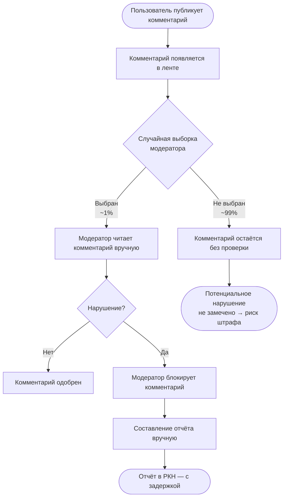
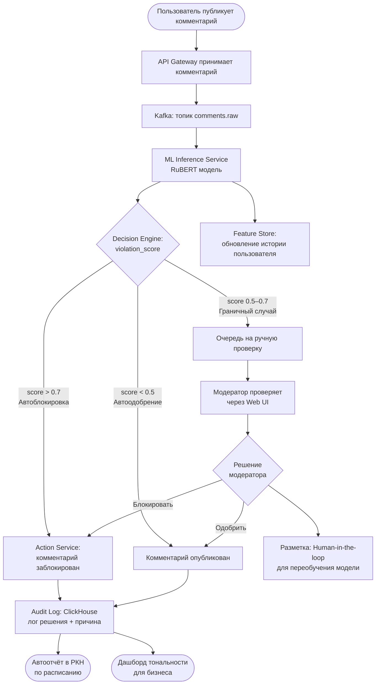

# Диаграммы бизнес-процессов (BPMN)

## AS-IS — Текущий процесс модерации

**Описание:** Модераторы вручную просматривают выборочные комментарии. Охват < 1% от ежедневного потока. Процесс медленный, субъективный и не масштабируемый.

**Ключевые проблемы AS-IS:**
- Охват 1% → 99% комментариев не проверяются.
- Задержка реакции: часы–дни.
- Нет аналитики тональности для бизнеса.
- Субъективность: разные модераторы принимают разные решения.

---

## TO-BE — Процесс с ML-системой

**Описание:** ML-система обрабатывает 100% комментариев в реальном времени. Модераторы работают только с пограничными случаями. Нарушения блокируются автоматически с логированием для РКН.

**Что меняет ML-система:**

| Аспект | AS-IS | TO-BE |
|---|---|---|
| Охват проверки | 1% | 100% |
| Скорость решения | часы | < 500 мс |
| Нагрузка на модераторов | 100% комментариев | только пограничные (5–10%) |
| Отчётность для РКН | ручная, с задержкой | автоматическая, в реальном времени |
| Аналитика тональности | отсутствует | дашборд в реальном времени |
