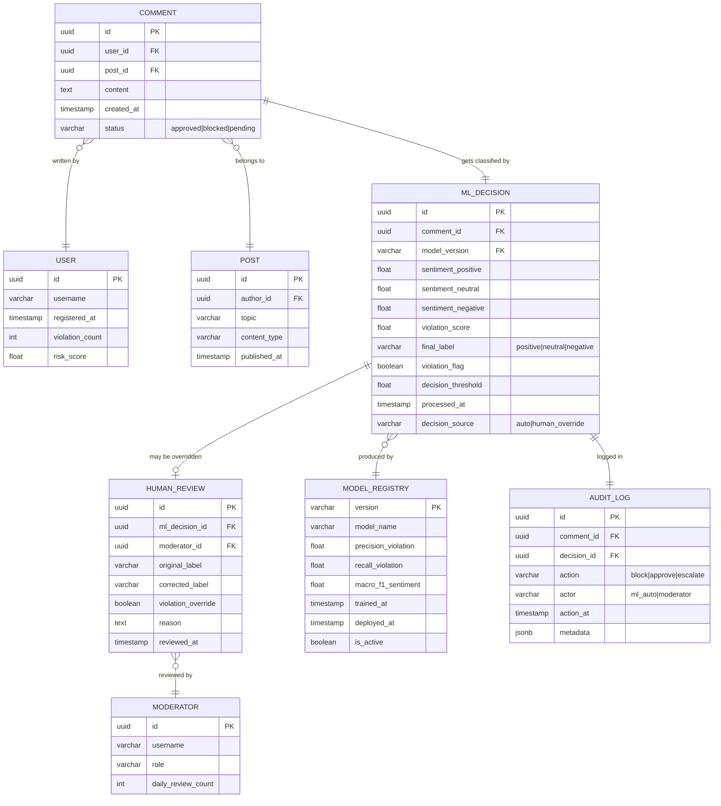

# Диаграмма структуры данных (ER)

**Описание:** Система использует распределённое хранилище. Горячие данные — Redis (кэш фич, временные решения), OLTP — PostgreSQL (модели, разметка, аккаунты), аналитика — ClickHouse (audit log, агрегаты тональности).

## ER-диаграмма (основные сущности)

## Распределённое хранилище

| Хранилище | Сущности | Обоснование |
|---|---|---|
| **PostgreSQL** | USER, POST, COMMENT, MODERATOR, MODEL_REGISTRY, HUMAN_REVIEW | ACID, внешние ключи, транзакции при обновлении статуса комментария |
| **ClickHouse** | AUDIT_LOG, агрегаты ML_DECISION | Аналитические запросы на 500M+ строках; columnar-хранение |
| **Redis** | Кэш risk_score пользователя, кэш фич поста, очередь pending reviews | TTL-кэш для < 1 мс доступа при инференсе |
| **MLflow** | Артефакты MODEL_REGISTRY (веса моделей, метрики) | Версионирование, A/B сравнение, rollback |
| **S3 (Yandex Object Storage)** | Сырые тексты комментариев для переобучения, бэкапы | Дешёвое хранение больших объёмов, доступ батчами |

**Почему данные распределены:** горячий путь инференса требует доступа к risk_score и фичам поста за < 1 мс — только Redis. OLTP-транзакции при блокировке — PostgreSQL. Аналитика тональности за квартал (сотни миллионов строк) — только ClickHouse справляется за приемлемое время.
