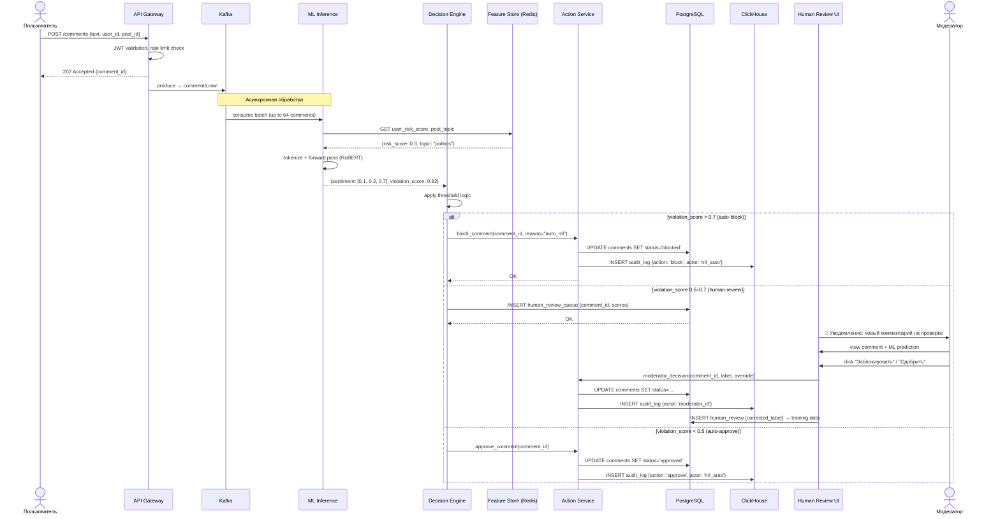
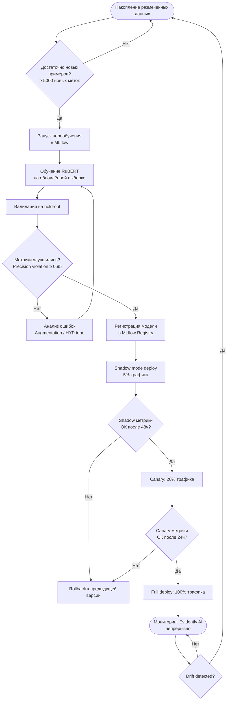
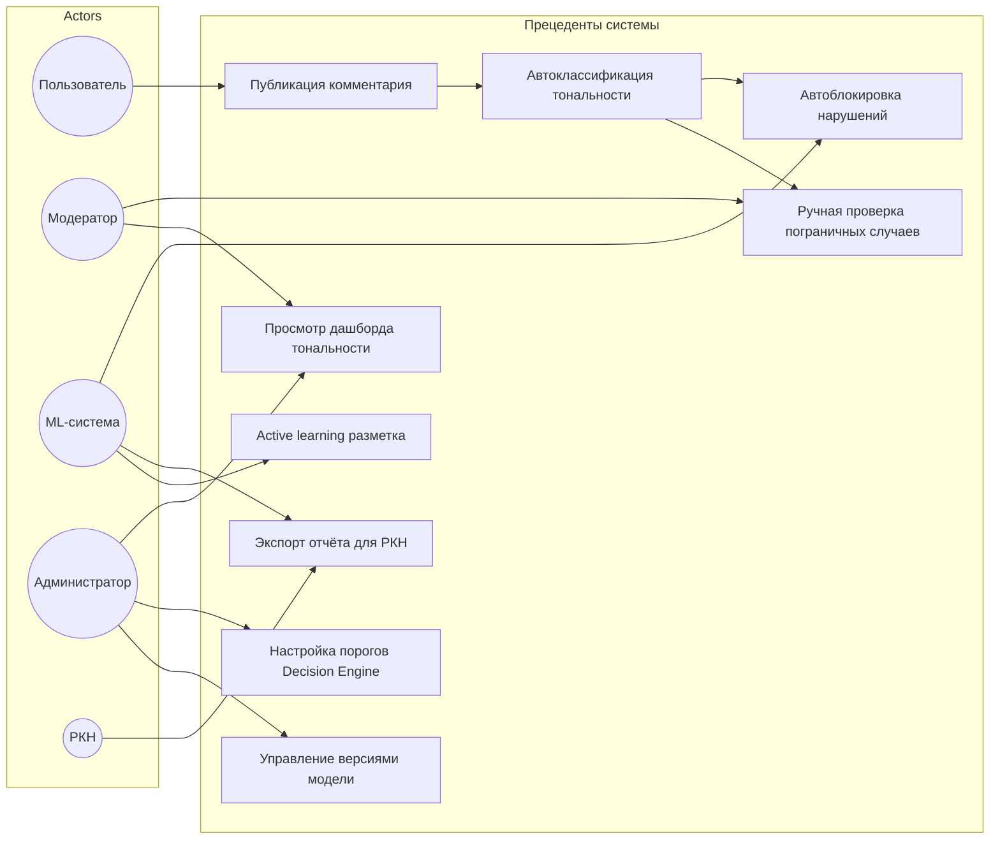

# UML-диаграммы поведения

## Диаграмма последовательности — обработка комментария

**Сценарий:** пользователь публикует комментарий, система классифицирует его и принимает решение об автоблокировке или отправке на ручную проверку.

---

## Диаграмма активностей — жизненный цикл модели

---

## Диаграмма прецедентов (Use Case)

